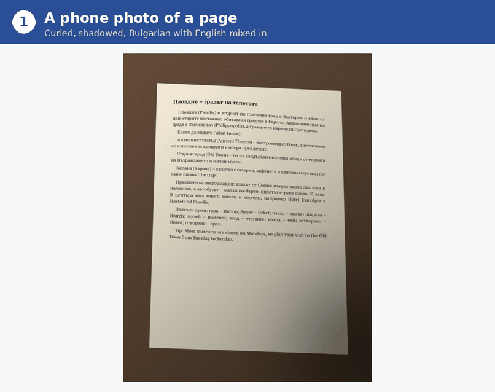
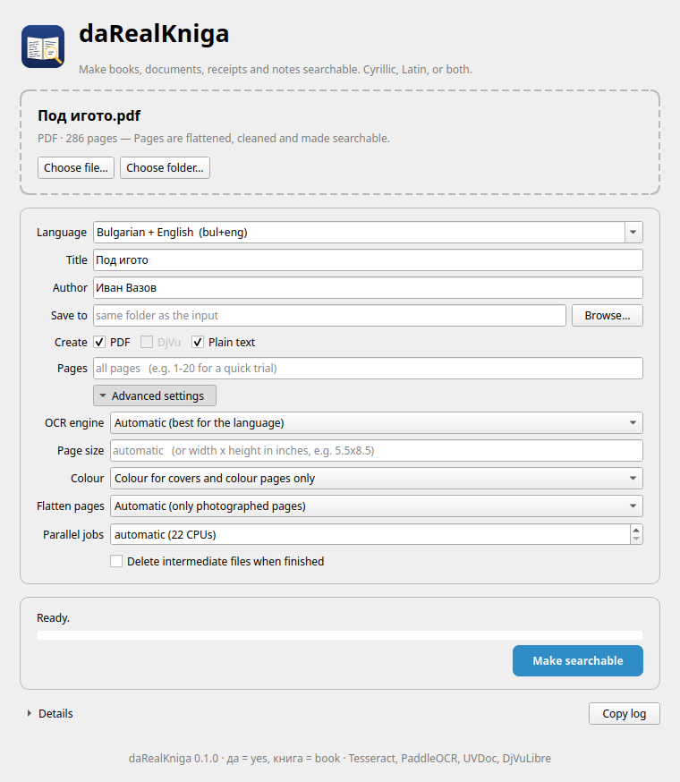
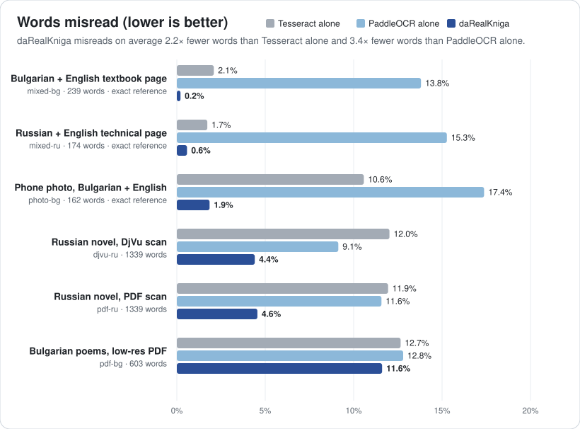

# daRealKniga

**OCR for Slavic and English documents: books, scans, photos, receipts and notes,
in Cyrillic, Latin, or both mixed.**

daRealKniga turns scanned or photographed pages into clean, **searchable** PDF (and DjVu)
files: text you can select, copy and search, on top of page images that look good and stay
small. It also writes the recognised text as a plain `.txt` file.

> *The name.* "daRealKniga" reads as "the real book", and also as "yes, a real book":
> **книга** (*kniga*) means "book" in Bulgarian and Russian, as in most Slavic languages, and
> **да** (*da*) means "yes". A real book, with real, searchable text.

<p align="center"></p>

<sub>A real run: the window processing a phone photo, a search in the PDF it writes, and
plain Tesseract's reading of the same photo for comparison. Regenerate with
`python packaging/make_demo.py`.</sub>

**Project page:** https://edgarbarrantes.github.io/daRealKniga/

### Who it's for

- **Slavic languages first.**
  - Bulgarian, Russian, Ukrainian, Belarusian, Macedonian and Serbian (Cyrillic).
  - Polish, Czech, Slovak, Slovenian, Croatian and Bosnian (Latin script).
  - English.
  - It works with any language Tesseract supports, but the defaults, tests and
    corrections are tuned for Slavic + English.
- **Old and long books, archives and libraries.** It's built for digitising whole books
  and collections, not just single pages:
  - **The original stays intact.** DjVu scans keep their page images exactly as they are,
    with an invisible text layer added. A PDF and a plain-text file are written next to them.
  - **Long books.** Hundreds of pages are processed in parallel. An interrupted run resumes
    where it stopped, and `--pages 1-20` tries the settings on a few pages first.
  - **Old print and paper.** Every page ends up the same size, even when the scans don't
    match. Photographed pages are flattened and their paper whitened. The tests include
    Bulgarian and Russian editions from the 1970s.
  - **Catalogue details.** The title and author are stored in the PDF.
  - **Private.** Everything runs on your own computer; nothing is uploaded.
- **Mixed Cyrillic and Latin text.** This is where daRealKniga stands out: language
  textbooks, dictionaries, bilingual documents, Cyrillic text with English terms, product
  names on receipts.
  - **The problem.** Ordinary OCR mixes up look-alike letters across the two alphabets
    (`a`/`а`, `c`/`с`, `p`/`р`, `H`/`Н`). The result looks right but can't be searched.
  - **What daRealKniga does.** It combines two OCR engines (Tesseract and PaddleOCR) and
    resolves every word with dictionaries and the script of the surrounding words.
- **Not only books.** It handles a whole scanned book, a phone photo of a single receipt,
  printed or typed notes, letters, forms or a stack of document photos (handwriting is not
  supported). Photos are flattened, the lighting is evened out and the paper is whitened
  before OCR.

### What goes in and what comes out

| Input | What happens | Output |
|---|---|---|
| **DjVu** book or document (already scanned) | pages are OCR'd; images are kept as they are | the same `.djvu` with a hidden text layer, a layered `.pdf`, a `.txt` |
| **Photos**: a single image (receipt, note, letter), a folder of images, or a PDF made of photos | pages are flattened, cleaned, resized and OCR'd | a compact `.pdf` with a text layer, a `.txt` |
| **Flat scans** as a PDF or images | same as photos; flattening is skipped automatically | `.pdf`, `.txt` |

Every output page has **the same size**, even when the source pages were scanned at
different resolutions.



## Accuracy

How much better is this than running an OCR engine on its own? Every sample below is read
three ways: by **Tesseract alone**, by **PaddleOCR alone**, and by **daRealKniga**, which
combines both. The numbers are generated by the [test suite](#tests) and committed with the
code, so every change can be compared with the previous results.

<!-- benchmark:start -->



Across the samples, daRealKniga misreads on average **2.2× fewer words** than Tesseract alone and **3.4× fewer words** than PaddleOCR alone. All three read the same original page images with the same OCR models; the difference is daRealKniga's page cleanup, the combination of both engines and its corrections.

| Sample | Words | Tesseract alone | PaddleOCR alone | **daRealKniga** |
|---|---:|---:|---:|---:|
| Bulgarian + English textbook page <br><sub>synthetic scan of a language-textbook page: Bulgarian with English words and sentences</sub> | 239 | 97.9% | 86.2% | **99.8%** |
| Russian + English technical page <br><sub>synthetic scan of a manual page: Russian with English terms, commands and names</sub> | 174 | 98.3% | 84.7% | **99.4%** |
| Phone photo, Bulgarian + English <br><sub>synthetic phone photo of a travel-guide page (curled, in perspective, uneven light): Bulgarian with English names and phrases</sub> | 162 | 89.4% | 82.6% | **98.1%** |
| Russian novel, DjVu scan <br><sub>DjVu scan mode, Russian prose (Вазов, Под игом, 1970)</sub> | 1339 | 88.0% | 90.9% | **95.6%** |
| Russian novel, PDF scan <br><sub>PDF of the same edition (cropped flat scans); reference = the DjVu text layer</sub> | 1339 | 88.1% | 88.4% | **95.4%** |
| Bulgarian poems, low-res PDF <br><sub>Bulgarian poetry and prose, 133 dpi two-page spreads (Вазов, Събрани съчинения т. 4, 1974); the reference has many OCR errors of its own</sub> | 603 | 87.3% | 87.2% | **88.4%** |

<sub>Word accuracy: the share of words read exactly right (letter case aside; a Latin letter in place of its Cyrillic look-alike counts as an error, because it breaks search). Synthetic pages have an exact reference; for real scans the reference is the book's existing text layer, itself OCR, so those numbers measure agreement.</sub>

<details><summary><b>Examples: words plain OCR got wrong and daRealKniga got right</b></summary>

| Printed | Tesseract alone | PaddleOCR alone | daRealKniga |
|---|---|---|---|
| а | **a** | – | а ✓ |
| open | **ореп** | **оре**n | open ✓ |
| монастырских | мопастырских | мопастырскнх | монастырских ✓ |
| внимание | впимание | вшнмание | внимание ✓ |
| наполняя | паполпяя | паполняя | наполняя ✓ |
| стену | степу | – | стену ✓ |
| них | пих | пих | них ✓ |
| са | **ca** | са ✓ | са ✓ |
| нов | **HOB** | нов ✓ | нов ✓ |
| от | **OT** | от ✓ | от ✓ |
| or | **ог** | or ✓ | or ✓ |
| да | **na** | да ✓ | да ✓ |

<sub>**Bold** letters come from the wrong alphabet: they look identical on screen but make the word unsearchable.</sub>

</details>

<sub>Last run 2026-10-08 · daRealKniga 0.3.0 · Tesseract 5.3.4 · PaddleOCR 3.7.0. Reproduce with `python tests/accuracy.py --save`; see [Tests](#tests).</sub>

<!-- benchmark:end -->

## Get it

| System | How |
|---|---|
| **Linux** (64-bit, about 2022 onwards) | The ready-made [AppImage](#download-linux-appimage), or [from source](#install-on-linux-from-source) |
| **macOS** (Apple Silicon or Intel) | [Install on macOS](#install-on-macos) |
| **Windows** 10 or 11 (64-bit) | [Install on Windows](#install-on-windows) |

There's no ready-made app for macOS or Windows yet: you install it with a few commands
instead. The window and the command line work the same on all three.

> **macOS and Windows support is a work in progress.** It's tested automatically on both,
> but has seen far less real use than Linux. If something doesn't work, or the instructions
> are unclear, please [open an issue](../../issues/new/choose): feedback from Mac and
> Windows users is much appreciated.

## Download (Linux AppImage)

The easiest way is the AppImage from the [Releases page](../../releases/latest); you can
also [build it yourself](#building-the-appimage). It has everything bundled: Python,
PaddleOCR, Tesseract 5, DjVuLibre and the interface. The command is written as one
lowercase word: `darealkniga`.

```bash
chmod +x darealkniga-*-x86_64.AppImage
./darealkniga-*-x86_64.AppImage                  # opens the window (or double-click it)
./darealkniga-*-x86_64.AppImage make book.djvu   # command line, same options as below
```

- **Systems.** It runs on 64-bit Linux distributions from about 2022 onwards (glibc 2.35+).
- **No FUSE?** On systems without FUSE (`libfuse2`), use the `.tar.gz` from the same
  release: extract it and run `darealkniga-<version>/AppRun`.
- **First run.** The first document downloads the OCR models: about 45 MB, plus 10–15 MB
  for each Tesseract language you use.

### Using the window

1. **Choose the document.** Drop a `.djvu`, a `.pdf`, a photo or a folder of photos on the
   window, or use **Choose file…** / **Choose folder…**.
2. **Settings.** Pick the **text language** and optionally a title and author. For text that mixes
   alphabets, pick a "+ English" option such as **Bulgarian + English**. The results are
   saved next to the input unless you choose another folder. For a long book, try `1-20` in
   **Pages** first.
3. **Run.** Press **Make searchable**.
   - **Progress.** The bar shows each stage.
   - **Details.** Shows the full log.
   - **Cancel.** A cancelled or interrupted book resumes where it stopped when started
     again.
4. **Results.** When it's done, **Open PDF** and **Show in folder** take you to the
   results.

**Advanced settings** has the OCR engine, page size, colour handling, flattening,
parallelism and clean-up.

**Interface language.** The window is available in 31 languages:
- **Slavic:** Belarusian, Bosnian, Bulgarian, Croatian, Czech, Macedonian, Polish, Russian,
  Serbian (Cyrillic and Latin), Slovak, Slovenian and Ukrainian.
- **Other European:** Catalan, Danish, Dutch, English, Estonian, Finnish, French, German,
  Greek, Hungarian, Italian, Latvian, Lithuanian, Norwegian, Portuguese, Romanian, Spanish
  and Swedish.

It starts in your system's language when it's one of these, and the menu at the top right
switches it at any time without losing what you've entered. The text language on first
start follows the interface language (Polish interface, Polish text), and can be changed
as usual. The log under **Details** and the command line stay in English.

## Install from source

All three systems need:
- **Python 3.10 to 3.13.** PaddleOCR doesn't support newer versions yet.
- **Tesseract 4 or newer.** On Linux, **Docker** works instead: without a local
  `tesseract`, daRealKniga builds a small Tesseract image and uses that.
- **DjVuLibre**, only for DjVu input.
- About **2 GB** of disk space for the Python packages.

Commands below install into a `.venv` folder inside the downloaded repository; deleting the
folder removes everything. `drk` is a short form of the same command: `drk make book.pdf
--lang bul` works exactly like `darealkniga make book.pdf --lang bul`.

On first use, the PaddleOCR and UVDoc models (about 45 MB) are downloaded to `~/.paddlex`.
Tesseract language models (`tessdata_best`, the most accurate ones, 10–15 MB each) are
downloaded to `~/.cache/darealkniga/tessdata` (on Windows, `.cache\darealkniga\tessdata`
in your user folder).

### Install on Linux (from source)

```bash
sudo apt install git python3-venv tesseract-ocr djvulibre-bin   # Debian/Ubuntu; similar elsewhere
git clone https://github.com/EdgarBarrantes/daRealKniga.git
cd daRealKniga
./install.sh            # creates .venv, installs, links darealkniga and drk into ~/.local/bin
darealkniga doctor      # checks every dependency
darealkniga gui         # the window (or darealkniga-gui)
```

### Install on macOS

*Work in progress: feedback is much appreciated, see [Get it](#get-it).*

Works on Apple Silicon and Intel Macs. It uses [Homebrew](https://brew.sh); install that
first if you don't have it.

```bash
brew install python@3.12 tesseract djvulibre git
git clone https://github.com/EdgarBarrantes/daRealKniga.git
cd daRealKniga
PYTHON=python3.12 ./install.sh   # creates .venv, installs, links darealkniga and drk into ~/.local/bin
```

`~/.local/bin` isn't on the macOS `PATH` by default. Add it once, then open a new Terminal
window:

```bash
echo 'export PATH="$HOME/.local/bin:$PATH"' >> ~/.zprofile
```

After that:

```bash
darealkniga doctor      # checks every dependency
darealkniga gui         # the window
drk make book.pdf --lang rus+eng
```

The window is started from Terminal for now; there's no app in the Applications folder
yet. Tesseract and DjVuLibre from Homebrew are found even when they aren't on the `PATH`.

### Install on Windows

*Work in progress: feedback is much appreciated, see [Get it](#get-it).*

Works on 64-bit Windows 10 and 11 on Intel or AMD processors. Windows on ARM isn't
supported, because PaddleOCR has no build for it. Run these in **PowerShell**:

```powershell
winget install Python.Python.3.12
winget install Git.Git
winget install UB-Mannheim.TesseractOCR
```

Then close and reopen PowerShell, so it picks up the new programs, and run:

```powershell
git clone https://github.com/EdgarBarrantes/daRealKniga.git
cd daRealKniga
powershell -ExecutionPolicy Bypass -File install.ps1    # creates .venv and installs
.venv\Scripts\darealkniga-gui.exe                       # the window
.venv\Scripts\drk.exe make book.pdf --lang bul+eng       # command line
```

- **Shortcut to the window.** Create a desktop shortcut to `.venv\Scripts\darealkniga-gui.exe`
  to open the window without PowerShell.
- **Commands anywhere.** At the end, `install.ps1` prints how to add the commands to your
  `PATH`, so that `darealkniga` and `drk` work in any folder.
- **Where it finds the tools.** Tesseract is found in its usual install folder
  (`C:\Program Files\Tesseract-OCR`), even though its installer doesn't add it to the `PATH`.
- **DjVu input.** For DjVu files, also install
  [DjVuLibre for Windows](https://sourceforge.net/projects/djvu/files/DjVuLibre_Windows/).
  It's found in its usual install folder too.
- **Check it.** `.venv\Scripts\darealkniga.exe doctor` checks that everything is in place.

## Use

```bash
# DjVu textbook in Bulgarian + English
darealkniga make "Bulgarian for Beginners - Part 1.djvu" --lang bul+eng

# a single photo: receipt, letter, note
darealkniga make receipt.jpg --lang ukr+eng

# phone photos of a book, as one PDF or as a folder of images
darealkniga make book.pdf --lang bul --title "Под игото" --author "Иван Вазов"
darealkniga make phone-photos/ --lang rus --page-size 6x9

# try a few pages first
darealkniga make book.djvu --pages 1-20 -o /tmp/trial
```

Outputs go next to the input (or to `-o FOLDER`) as `<name> (OCR).pdf/.djvu/.txt`.
Intermediate files are kept in `<output>/.darealkniga/<name>/`. Rerunning the same command
resumes where it stopped and redoes only the stages whose settings changed. Pass
`--cleanup` to delete them at the end.

Main options (`darealkniga make --help` lists them all):

| Option | Meaning |
|---|---|
| `-l, --lang` | Tesseract codes, main language first: `bul+eng`, `rus`, `ukr+eng`, `deu`, ... |
| `--engine` | `tesseract`, or `fused` (Tesseract + PaddleOCR; slower, 1–3 points more accurate). `auto` uses fused for Cyrillic languages |
| `--page-size WxH` | output page size in inches. Default: DjVu uses the book's typical page size; photos use `--page-width` (5.5) and the pages' aspect ratio |
| `--color auto/never/always` | photo mode: `auto` keeps colourful pages (covers) in colour and makes the rest greyscale |
| `--unwarp auto/always/never` | photo mode: flatten with UVDoc. `auto` flattens only pages that look like photos (background or shadows around the page); cropped flat scans are left untouched |
| `--formats pdf,djvu,txt` | which outputs to write |
| `--pages 1-20,35` | process only some pages |
| `-j, --jobs` | parallelism (default: all CPUs) |

## How it works

### Scan mode (DjVu)

1. **Page geometry.** Read each page's pixel size and dpi. Pages stored at a much higher
   resolution than the rest but labelled with the same dpi would display 2–4× larger, so
   their dpi is corrected. The output page box is the median width × 95th-percentile height.
2. **Render** each page in greyscale at up to 300 dpi for OCR.
3. **OCR.** Tesseract (`tessdata_best`) gives accurate word boxes and is strong on Cyrillic.
   For Cyrillic books, PaddleOCR PP-OCRv5 also runs on every page.
4. **Fusion** (`fuse.py`). Words are matched by position. Where the engines disagree, the
   reading found in the language's lexicon wins (wordfreq).
   - Latin/Cyrillic look-alikes (`ce`/`се`, `Ha`/`На`, `6`/`б`) are resolved using the
     script of the surrounding words.
   - Stress accents are removed so words can be searched.
   - Letter case is repaired. Many Cyrillic capitals are just bigger lower-case letters
     (с/С, и/И, г/Г), so OCR produces "МНОго", "СИ" mid-sentence, or "Ги" after a hyphenated
     line break. These are fixed using the other engine's reading, the sentence position and
     the dictionary. Names, acronyms and headings are left alone.
   - Some typefaces make Tesseract misread н as п (or и, ш/щ, ь/ъ) all over a page
     ("па", "мопастырь"). On pages where this happens systematically, lower-case words not
     in the lexicon are replaced by a far more frequent look-alike spelling. Names and
     isolated hits are left alone.
5. **DjVu output.** The original file gets a hidden text layer with page, line and word
   boxes, and per-page dpi values that make every page display at the same width. The page
   images are not re-encoded.
6. **PDF output.** Each DjVu page is rebuilt as a layered page:
   - a ~100 dpi JPEG background;
   - the full-resolution 1-bit text mask (CCITT G4), carrying a low-resolution colour layer
     for the ink.

   This keeps text sharp at about 3 MB per 100 pages. Pages are scaled to fit the common
   page box and centred.

### Photo mode (images or image PDF)

1. **Extract.**
   - From a PDF, the embedded photos are taken without recompression.
   - From a folder, images are sorted by name in natural order (`2.jpg` before `10.jpg`),
     and EXIF rotation is applied.
2. **Flatten** with UVDoc (a document-unwarping network). It straightens curled lines,
   removes perspective, and crops away the background and fingers. Each page is checked
   first: a page with background or shadows around it counts as a photo. A cropped flat
   scan, with paper right up to the edges, is left as it is, because flattening and edge
   trimming would cut off its outer lines.
3. **Clean** (`enhance.py`):
   - **Lighting.** The paper brightness is estimated, filling in large dark regions such as
     photos from the paper around them, and the page is divided by it. This removes shadows
     and uneven light.
   - **Text.** The paper turns white, which also hides text showing through from the other
     side, and ink is darkened and sharpened.
   - **Photos.** Photos are detected (large dark regions) and get a gentle curve and a blur
     that hides the printing dots.
   - **Colour.** Colourful pages (covers) are only white-balanced and stay in colour.
   - **Size.** Every page is resized to the same size at 400 dpi.
4. **OCR** as above, on the cleaned 400 dpi pages.
5. **PDF.**
   - **Text** becomes a 1-bit stencil, binarised (Sauvola) from a 2× upscaled copy, which
     gives smooth glyph edges at 800 dpi.
   - **Photos** are stored as a separate greyscale JPEG at 200 dpi.
   - **Covers** are stored as colour JPEGs.

   A 130-page book comes out at about 20 MB.

### The text layer

The invisible text uses the same technique as Tesseract's own PDF output:
- A glyph-less font whose character codes are UTF-16 and map one-to-one back to Unicode.
- Text is drawn invisibly (render mode 3), and each word is stretched horizontally to
  exactly cover its box on the page.

Selection, copy and search therefore line up with the printed words in any PDF viewer. The
`.txt` export rejoins words hyphenated across line ends.

## Tests

```bash
.venv/bin/pip install --prefer-binary -e ".[test]"
.venv/bin/pytest                  # everything (~1 min after the first run)
.venv/bin/pytest -m "not accuracy" # unit tests only (no downloads, < 1 s)
.venv/bin/python tests/accuracy.py # just the accuracy table
```

[GitHub Actions](.github/workflows/tests.yml) runs the fast unit and interface tests on
Linux, macOS and Windows for every push and pull request, plus a one-page OCR run on each
system. Run the accuracy tests locally before larger changes.

The **accuracy tests** process a few pages per sample, with any existing text layer
removed. The text is then read back from every output (PDF, DjVu, TXT) and scored against
the reference. The same pages are also read by plain Tesseract and plain PaddleOCR for
comparison. The samples:

| Sample | Source | Reference | Mode |
|---|---|---|---|
| `mixed-bg` | synthetic textbook page: Bulgarian with English words and sentences | exact | photo mode |
| `mixed-ru` | synthetic manual page: Russian with English terms, commands and names | exact | photo mode |
| `djvu-ru` | Иван Вазов, *Под игом* (Russian edition, 1970), DjVu, 4 pages | the book's text layer | scan mode |
| `pdf-ru` | the same edition as a PDF, 4 pages | the DjVu's text layer | photo mode (flat scans) |
| `pdf-bg` | Иван Вазов, *Събрани съчинения*, т. 4 (1974), Bulgarian PDF, 3 two-page spreads | the book's text layer | photo mode |

- **Synthetic pages.** They are typeset in PT Serif from the texts in
  [`tests/samples/`](tests/samples) and degraded like a scan (tilt, blur, noise, JPEG).
- **Real scans.** These come from the Internet Archive.
- **Downloads.** The books and the font are downloaded once (~40 MB) to
  `~/.cache/darealkniga/testdata` and checked against SHA-256 hashes.

[Accuracy](#accuracy) shows the latest results. They are saved in
[`benchmarks/results.json`](benchmarks/results.json), with one row per run in
[`benchmarks/history.csv`](benchmarks/history.csv).

```bash
python tests/accuracy.py          # run, and show the change against the saved results
python tests/accuracy.py --save   # also update benchmarks/, the chart and the README section
```

- **`pdf-bg`** (real scan) scores lower for three reasons:
  - it is a 133 dpi scan;
  - its reference text has many errors of its own ("бопбата", "гкева"), which daRealKniga
    reads correctly;
  - its two-page spreads affect reading order.

Each sample has minimum scores, and the tests also check the outputs themselves:
- the page count is right and every page is the same size;
- every page has text;
- the text layer stays within the page;
- DjVu pages display at the same width.

## Building the AppImage

```bash
packaging/build-in-docker.sh               # needs only Docker
VERSION=1.2.0 packaging/build-in-docker.sh
```

This builds inside a clean Ubuntu 22.04 container, so the AppImage works on most
distributions. It writes `dist/darealkniga-<version>-x86_64.AppImage`, a portable `.tar.gz`
and `SHA256SUMS`.
- **Inside Ubuntu 22.04.** On a 22.04 machine or container, you can run
  `packaging/build-appimage.sh` directly, as root.
- **What gets bundled.** Python comes from python-build-standalone. daRealKniga is installed
  with its dependencies and the Qt interface. Tesseract 5 and the DjVuLibre tools are copied
  in with their libraries using linuxdeploy. Every downloaded tool is checked against a
  pinned SHA-256.
- **Checks.** The build runs `doctor` and opens the window offscreen before packing.

## Contributing

Pull requests are welcome.
- **Before opening one**, run `pytest`.
- **For OCR changes**, compare the accuracy table before and after.
- **For a new kind of document or language**, add a short sample to `tests/accuracy.py`.
  Use a few pages of a public-domain or openly licensed source that already has a good text
  layer.
- **Translations.** The interface texts are in `darealkniga/data/i18n/<language>.json`,
  one file per language, mapping each English text to its translation. They were written
  without a native-speaker review, so corrections from native speakers are especially
  welcome: edit the file and check the result with
  `DAREALKNIGA_UI_LANG=<code> darealkniga gui`. Texts with a count, like `"{n} page"`, list
  one form per plural category of the language (see `PLURALS` in `darealkniga/i18n.py`).
  Serbian Latin is generated from the Serbian Cyrillic file. To add a language, add its
  file plus an entry in `LANGUAGES` and `PLURALS` in `i18n.py`; `pytest` checks that every
  file has every text, the same `{placeholders}` and the right number of plural forms.

## Reporting problems and ideas

Bug reports and suggestions are very welcome. Please use the repository's
[**Issues** page](../../issues/new/choose):

- **Problem report.** For crashes, errors, or results that look wrong: misread text,
  badly cleaned pages, wrong page sizes. The form asks for:
  - **Version.** It's shown at the bottom of the window, or run `darealkniga --version`.
  - **How you run it.** AppImage, tarball or pip.
  - **The language and settings**, or the command you used.
  - **The log.** In the window, open **Details** and press **Copy log**.
  - **The output of `darealkniga doctor`.**
- **Idea or request.** For new features, languages or input formats.

If a page comes out badly, attach a **page or two** as an example: a screenshot or a short
excerpt is enough. Please don't upload whole copyrighted books. In the AppImage,
**Report a problem…** next to the log opens the issue form directly.

## Tips & limitations

- **Photographing a book.** Use even light and no flash. Fill the frame with a single page,
  or crop two-page spreads before processing. Hold the camera steady: blurry areas stay
  slightly soft.
- **Receipts, notes and single pages.** Take the photo straight on, with the whole page
  in the frame and some background around it, so daRealKniga can find the edges and flatten
  it. Choose the language mix you expect, e.g. **Ukrainian + English** for a receipt with
  English product names.
- **Ordering.** Photo order follows the file names, so make sure they sort correctly.
- **Hyphenation.** A word hyphenated across a line break is two words in the PDF's text
  layer, so searching for the whole word won't find it. The `.txt` export joins them.
- **Fusion.** The fusion rules are tuned for Cyrillic (+ Latin). Other scripts use
  Tesseract alone.
- **Maps, tables and handwriting.** These OCR poorly. That doesn't affect the page images.
- **Memory.** The PDF stage of photo mode uses about 1 GB per parallel job. Lower `-j` on
  small machines.

## License

MIT for daRealKniga. `data/glyphless.ttf` comes from Tesseract (Apache-2.0). Tesseract,
PaddleOCR, UVDoc and DjVuLibre keep their own licences.
